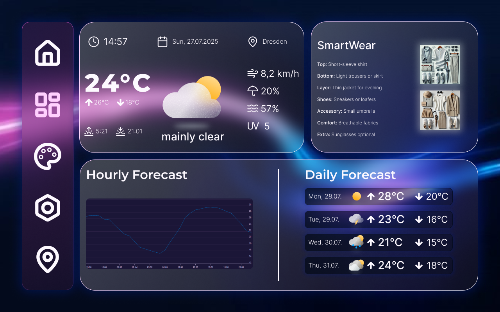
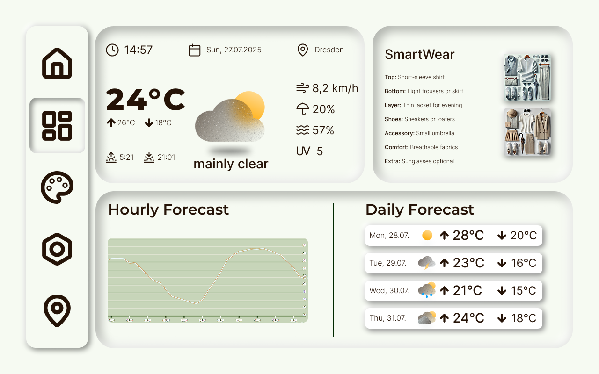

# Weather App

A responsive weather dashboard built with React and JavaScript.




[Live Demo (coming soon)](https://tryx07.github.io/weather-dashboard)

## Features

- Real-time weather data from OpenWeatherMap API
- Search weather by city name
- Responsive design for desktop and mobile
- Dark/light mode toggle
- Current weather and 5-day forecast
- Clean, modern UI with Tailwind CSS

## Tech Stack

- **Frontend:** React 18, JavaScript ES6+
- **Styling:** Tailwind CSS
- **API:** OpenWeatherMap API
- **HTTP Client:** Axios
- **Deployment:** GitHub Pages

## Getting Started

### Prerequisites
- Node.js (version 14 or higher)
- npm or yarn package manager

### Installation

1. Clone the repository
   ```bash
   git clone https://github.com/tryx07/weather-dashboard.git
   cd weather-dashboard
   ```

2. Install dependencies
   ```bash
   npm install
   ```

3. Get your API key from [OpenWeatherMap](https://openweathermap.org/api)

4. Create a `.env` file in the root directory
   ```
   REACT_APP_WEATHER_API_KEY=your_api_key_here
   ```

5. Start the development server
   ```bash
   npm start
   ```

6. Open [http://localhost:3000](http://localhost:3000) to view it in the browser

## What I Learned

*coming soon!*

## Future Enhancements

- Add weather maps integration
- Implement geolocation for automatic city detection
- Add weather alerts and notifications
- Create weather data visualization charts

## Contributing

This is a learning project, but feedback and suggestions are welcome!

## Contact

- GitHub: [Tryx07](https://github.com/tryx07)