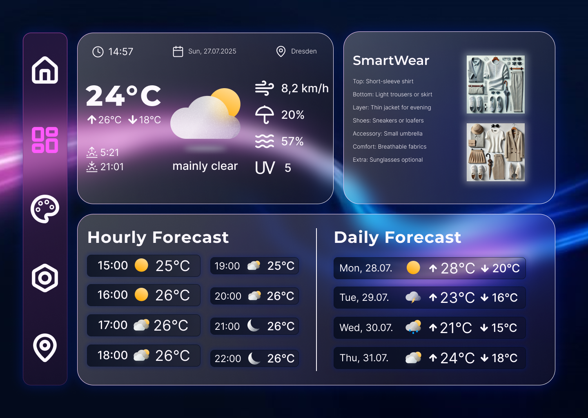
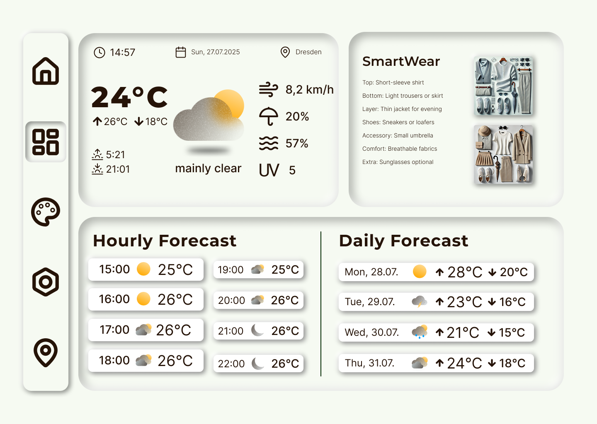

# Weather App

A responsive weather dashboard built with React and JavaScript.

# [Live Demo](https://weather-dashboard-tryxs-projects-405594af.vercel.app)

## Protoype
- Designed with Figma
  



## Features

- Real-time weather data from OpenMeteo API
- Search weather by city name
- Clothing recommendations based on weather
- Responsive design for desktop and mobile
- Dark/light mode toggle
- Current weather and 5-day forecast
- Clean, modern UI with Tailwind CSS

## Tech Stack

- **Frontend:** React 18, JavaScript ES6+
- **Styling:** Tailwind CSS
- **API:** OpenMeteo API
- **HTTP Client:** Axios
- **Deployment:** Vercel

## Getting Started

### Prerequisites
- Node.js (version 14 or higher)
- npm or yarn package manager

### Local installation

1. Clone the repository
   ```bash
   git clone https://github.com/tryx07/weather-dashboard.git
   cd weather-dashboard
   ```

2. Install dependencies
   ```bash
   npm install
   ```

3. Start the development server
   ```bash
   npm start
   ```

4. Open [http://localhost:3000](http://localhost:3000) to view it in the browser

## What I Learned

- **Plan thoroughly**: Planning things out makes the development way easier
- **Documentation is key**: Helping others understand and keeping track of what you are doing
- **Keep it simple**: It's better doing one thing really good than multiple things poorly
- **Problem solving approach**: Do research - try solutions - document experiences
- **Naming matters**: Keep variable names consistent, meaningful and distinct
- **Learning by debugging**: Most insights came from **errors and debugging**

## Future Enhancements

- Add weather maps integration
- Implement geolocation for automatic city detection
- Add weather alerts and notifications
- Create weather data visualization charts

## Assets & Credits
- UI icons: [Lucide](https://lucide.dev) – MIT License
- Weather icons: [Meteocons](https://bas.dev/work/meteocons) – MIT License

## Contributing

This is a learning project, but feedback and suggestions are welcome!

## Contact

- GitHub: [Tryx07](https://github.com/tryx07)
